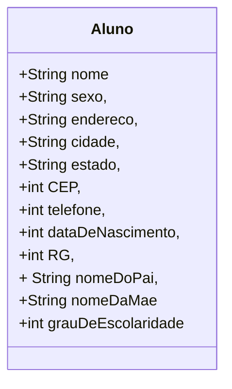

# Cadastro-de-alunos
Aplicativo de cadastro de alunos como exercício nas aulas de desenvolvimento de sistemas do Senac

## Fase 1

Iniciando a proposta, que é construir um sistema de informação, declare as variáveis para o algoritmo de cadastramento de alunos, cujos dados são:

- nome,
- sexo,
- endereço,
- cidade,
- estado,
- CEP,
- telefone,
- data de nascimento,
- RG,
- nome do pai,
- nome da mãe
- grau de escolaridade

Classifique os dados segundo os tipos das variáveis (numéricos, literais ou lógicos) que irão armazená-los.

- Variáveis literais:	nome do aluno, sexo, endereço, cidade, estado,	nome do pai, nome da mãe.
- Variáveis numéricas:	telefone, CEP, RG, data de nascimento, grau de 	escolaridade....

## Diagrama de classe:



## Fase 2 cap. 4

Atribuição de valores às variáveis:

O usuário entra com valores pra preencher as variáveis:

```
		leia “Entre com o sexo:”, SEXO
		leia “Entre com o endereço:”, ENDERECO
		leia “Entre com a cidade onde o aluno reside:”, CIDADE
		leia “Entre com a sigla do estado onde o aluno reside:”, UF
		leia “Entre com o CEP (somente números):”, CEP
		leia “Entre com o telefone (somente números):”, FONE
		leia “Entre com o nome do pai do aluno:”, PAI
		leia “Entre com o nome da mãe do aluno:”, MAE
		leia “Entre com o Registro Geral (RG) do aluno (somente números)
		leia “Entre com o grau de escolaridade do aluno (0, 1, 2, 3):”, GRAUESC
		escreva “Aluno:”, NOME
		escreva “Sexo:”, SEXO, “Data de Nascimento:”, DATANASC
		escreva “Registro Geral (RG):”, RG
		escreva “Grau de escolaridade:”, GRAUESC, “grau”
		escreva “Endereço:”, ENDERECO, “Cidade:”, CIDADE, “Estado:”, UF
		escreva “CEP:”, CEP
		escreva “Telefone:”, FONE
		escreva “Nome do pai:”, PAI
		escreva “Nome da mãe:”, MAE
```

Cadastrar 50 alunos significa repetir o algoritmo anterior cinquenta vezes, ou seja, utilizar uma estrutura de repetição; neste caso, utilize a estrutura para/faça/fim-para. Para controlar a quantidade de alunos cadastrados, você deve utilizar uma variável contadora. Antes disso, porém, todas as variáveis do algoritmo devem ser declaradas.

## Fase3 cap. 4

Registro de alunos

Refatorar o algoritmo anterior usando funções para separar a lógica em partes mais organizadas e reutilizáveis.

```java
import java.util.Scanner;

public class aluno {
    public String nome, sexo, endereco, cidade, estado, nomeDoPai, nomeDaMae;
    public int cep, rg, grauDeEscolaridade, telefone, dataDeNascimento;

    public static void main(String[] args) {
        aluno aluno = new aluno();
        Scanner scanner = new Scanner(System.in);

        for (int i = 1; i <= 50; i++) {
            System.out.println("Entre com os dados do aluno " + i + ":");
            cadastraraluno(aluno, scanner);
            exibirDadosaluno(aluno);
        }
    }

    public static void cadastraraluno(aluno aluno, Scanner scanner) {
        System.out.println("Entre com o nome:");
        aluno.nome = scanner.next();

        System.out.println("Entre com o sexo:");
        aluno.sexo = scanner.next();

        System.out.println("Entre com o endereço:");
        aluno.endereco = scanner.next();

        System.out.println("Entre com a cidade onde o aluno reside:");
        aluno.cidade = scanner.next();

        System.out.println("Entre com a sigla do estado onde o aluno reside:");
        aluno.estado = scanner.next();

        System.out.println("Entre com o CEP (somente números):");
        aluno.cep = scanner.nextInt();

        System.out.println("Entre com o telefone (somente números):");
        aluno.telefone = scanner.nextInt();

        System.out.println("Entre com o nome do pai do aluno:");
        aluno.nomeDoPai = scanner.next();

        System.out.println("Entre com o nome da mãe do aluno:");
        aluno.nomeDaMae = scanner.next();

        System.out.println("Entre com o Registro Geral (RG) do aluno (somente números):");
        aluno.rg = scanner.nextInt();

        System.out.println("Entre com o grau de escolaridade do aluno (0, 1, 2, 3):");
        aluno.grauDeEscolaridade = scanner.nextInt();
    }

    public static void exibirDadosaluno(aluno aluno) {
        System.out.println("aluno: " + aluno.nome);
        System.out.println("Sexo: " + aluno.sexo);
        System.out.println("Registro Geral (RG): " + aluno.rg);
        System.out.println("Grau de escolaridade: " + aluno.grauDeEscolaridade);
        System.out.println("Endereço: " + aluno.endereco + ", Cidade: " + aluno.cidade + ", Estado: " + aluno.estado);
        System.out.println("CEP: " + aluno.cep);
        System.out.println("Telefone: " + aluno.telefone);
        System.out.println("Nome do pai: " + aluno.nomeDoPai);
        System.out.println("Nome da mãe: " + aluno.nomeDaMae);
    }
}
```

Nesse código refatorado, duas funções foram adicionadas: `cadastraraluno` e `exibirDadosaluno`.

A função `cadastraraluno` é responsável por solicitar e armazenar os dados de um aluno fornecidos pelo usuário. Ela recebe um objeto `aluno` e um scanner como parâmetros. Os dados são preenchidos no objeto `aluno` passado por referência.

A função `exibirDadosaluno` é responsável por exibir os dados de um aluno na tela

Refatorar o código novamente, dessa vez utilizando um construtor na classe `aluno` para inicializar os objetos e o método `toString()` para exibir os dados de cada aluno. Aqui está o código refatorado:

```java
import java.util.Scanner;

public class aluno {
    public String nome, sexo, endereco, cidade, estado, nomeDoPai, nomeDaMae;
    public int cep, rg, grauDeEscolaridade, telefone, dataDeNascimento;

    public aluno(String nome, String sexo, String endereco, String cidade, String estado, String nomeDoPai, String nomeDaMae,
                 int cep, int rg, int grauDeEscolaridade, int telefone, int dataDeNascimento) {
        this.nome = nome;
        this.sexo = sexo;
        this.endereco = endereco;
        this.cidade = cidade;
        this.estado = estado;
        this.nomeDoPai = nomeDoPai;
        this.nomeDaMae = nomeDaMae;
        this.cep = cep;
        this.rg = rg;
        this.grauDeEscolaridade = grauDeEscolaridade;
        this.telefone = telefone;
        this.dataDeNascimento = dataDeNascimento;
    }

    @Override
    public String toString() {
        return "aluno: " + nome + "\\n" +
                "Sexo: " + sexo + "\\n" +
                "Registro Geral (RG): " + rg + "\\n" +
                "Grau de escolaridade: " + grauDeEscolaridade + "\\n" +
                "Endereço: " + endereco + ", Cidade: " + cidade + ", Estado: " + estado + "\\n" +
                "CEP: " + cep + "\\n" +
                "Telefone: " + telefone + "\\n" +
                "Nome do pai: " + nomeDoPai + "\\n" +
                "Nome da mãe: " + nomeDaMae;
    }

    public static void main(String[] args) {
        Scanner scanner = new Scanner(System.in);

        for (int i = 1; i <= 50; i++) {
            System.out.println("Entre com os dados do aluno " + i + ":");
            aluno aluno = cadastraraluno(scanner);
            System.out.println(aluno);
        }
    }

    public static aluno cadastraraluno(Scanner scanner) {
        System.out.println("Entre com o nome:");
        String nome = scanner.next();

        System.out.println("Entre com o sexo:");
        String sexo = scanner.next();

        System.out.println("Entre com o endereço:");
        String endereco = scanner.next();

        System.out.println("Entre com a cidade onde o aluno reside:");
        String cidade = scanner.next();

        System.out.println("Entre com a sigla do estado onde o aluno reside:");
        String estado = scanner.next();

        System.out.println("Entre com o CEP (somente números):");
        int cep = scanner.nextInt();

        System.out.println("Entre com o telefone (somente números):");
        int telefone = scanner.nextInt();

        System.out.println("Entre com o nome do pai do aluno:");
        String nomeDoPai = scanner.next();

        System.out.println("Entre com o nome da mãe do aluno:");
        String nomeDaMae = scanner.next();

        System.out.println("Entre com o Registro Geral (RG) do aluno (somente números):");
        int rg = scanner.nextInt();

        System.out.println("Entre com o grau de escolaridade do aluno (0,

 1, 2, 3):");
        int grauDeEscolaridade = scanner.nextInt();

        return new aluno(nome, sexo, endereco, cidade, estado, nomeDoPai, nomeDaMae, cep, rg, grauDeEscolaridade, telefone, 0);
    }
}
```

## Fase4 cap. 10

Registro de alunos

Utilizar a estrutura de registro para cadastrar matrículas e notas de alunos em determinada disciplina.

Problema:  Monte o algoritmo de cadastramento de alunos utilizando a estrutura de registros. Represente o algoritmo em pseudocódigo.

Monte o algoritmo de cadastramento de alunos utilizando a estrutura de registros. Represente o algoritmo em pseudocódigo, e o código em java para fazer um formulário em uma gui swing, salvando em arquivo texto.

Segue abaixo o pseudocódigo para o algoritmo de cadastramento de alunos utilizando a estrutura de registros, seguido do código em Java para criar um formulário em uma GUI Swing e salvar as informações em um arquivo de texto:

Pseudocódigo:

1. Definir a estrutura de registro para o aluno, contendo os campos nome, idade, matrícula e curso.
2. Inicializar as variáveis de entrada nome, idade, matrícula e curso.
3. Criar um formulário com campos de entrada para nome, idade, matrícula e curso.
4. Ler as informações de entrada do usuário e armazená-las nas variáveis correspondentes.
5. Criar um objeto do tipo Aluno com as informações armazenadas nas variáveis.
6. Escrever as informações do objeto Aluno em um arquivo de texto.
7. Exibir uma mensagem de confirmação para o usuário.

Desafio: Para refatorar o algoritmo anterior de cadastramento de alunos utilizando a estrutura de registros e criar um formulário em uma GUI Swing para salvar as informações em um arquivo de texto, é necessário utilizar as bibliotecas Java Swing e Java I/O.


## Referência

Xavier, Gley Fabiano Cardoso
Lógica de programação
E-book. Disponível em: https://bibliotecadigitalsenac.com.br/?from=%3FcontentInfo%3D1306#/legacy/epub/1306
Acesso em 15/05/2023

[Editor de diagramas Mermaid](https://mermaid.live/)
